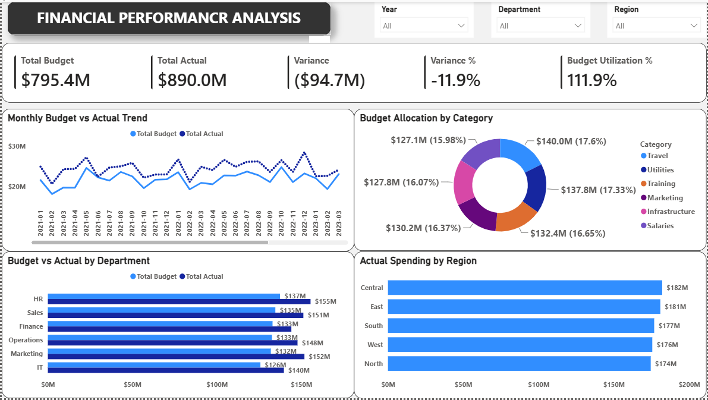
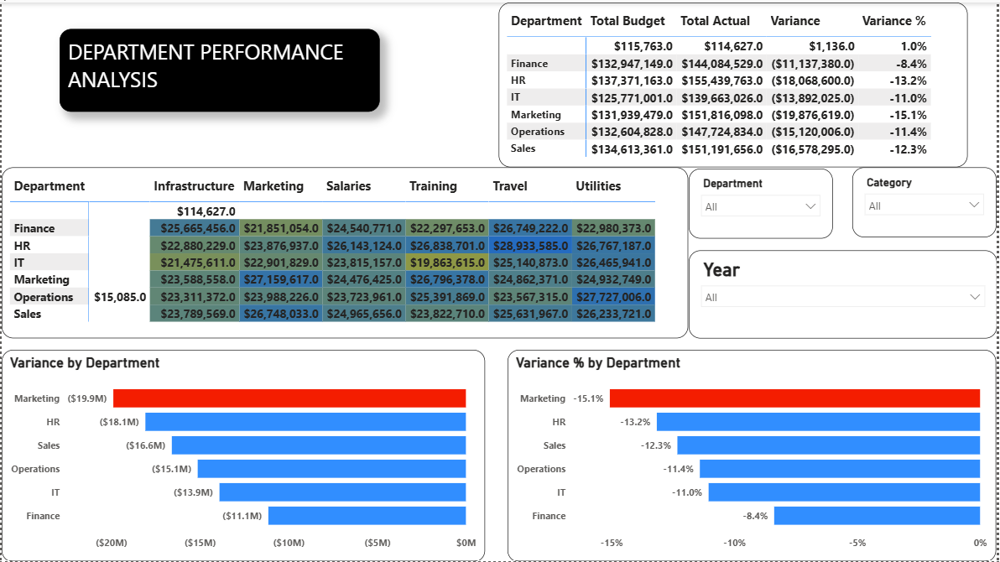
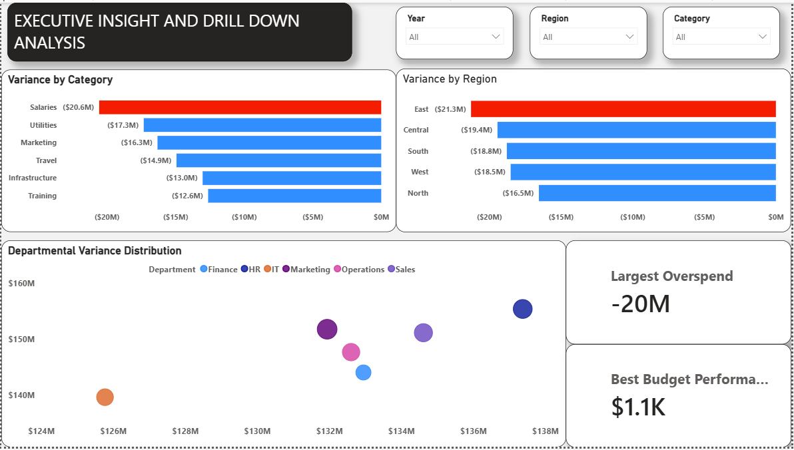

# 💰 Financial Performance Analysis Dashboard (Power BI)

## 📌 Project Overview

This project analyzes organizational financial performance by comparing budgeted spending against actual spending across departments, categories, regions, and time periods.

Using Power BI, the dashboard provides visibility into budget utilization, spending variances, department performance, and executive-level financial insights to support strategic decision-making.

---

## 🎯 Business Problem

Organizations must continuously monitor financial performance to ensure spending remains aligned with budget expectations.

Without proper financial visibility, management may struggle to:

- Identify overspending departments
- Monitor budget utilization
- Detect unfavorable spending trends
- Allocate resources effectively
- Make informed financial decisions

This dashboard helps executives and finance teams evaluate financial health and identify areas requiring corrective action.

---

## 📊 Dashboard Structure

## Page 1: Financial Performance Analysis

Focuses on:

- Budget vs Actual Performance
- Variance Analysis
- Budget Utilization
- Regional Spending Analysis
- Category Budget Allocation

Key visuals include:

- Monthly Budget vs Actual Trend
- Budget Allocation by Category
- Budget vs Actual by Department
- Actual Spending by Region
- Financial KPI Cards

### 📸 Financial Performance Analysis

---

## Page 2: Department Performance Analysis

Focuses on:

- Department Spending Performance
- Budget Efficiency
- Variance Analysis by Department
- Financial Accountability
- Department Comparison

Key visuals include:

- Department Budget Performance
- Variance by Department
- Budget Utilization Analysis
- Department Financial Ranking

### 📸 Department Performance Analysis

---

## Page 3: Executive Insight & Drill Down Analysis

Focuses on:

- Executive Financial Review
- Variance Investigation
- High-Risk Spending Areas
- Performance Drivers
- Strategic Decision Support

Key visuals include:

- Executive KPI Overview
- Variance Deep Dive
- Financial Drill-Down Analysis
- Department and Regional Performance

### 📸 Executive Insight & Drill Down Analysis

---

## 🔍 Key Business Insights

### 1. Actual Spending Exceeded Budget

The organization spent approximately $890M compared to a budget of $795M, resulting in an unfavorable variance of approximately $94.7M.

### 2. Budget Utilization Exceeded 100%

Budget utilization reached approximately 111.9%, indicating overspending relative to planned financial targets.

### 3. Certain Departments Consistently Overspent

Department-level analysis revealed spending levels above allocated budgets, highlighting areas requiring stronger cost controls.

### 4. Spending Trends Show Persistent Variance

Monthly trend analysis indicates that actual spending frequently exceeded budget expectations over multiple periods.

### 5. Regional Spending Is Relatively Balanced

Regional spending remains distributed across business locations, supporting diversified operational investment.

---

## 💡 Recommendations

### Financial Governance

- Strengthen budget monitoring processes.
- Review spending approvals for high-cost departments.
- Implement periodic variance reviews.

### Department Performance

- Investigate departments with recurring unfavorable variances.
- Establish spending accountability measures.
- Improve forecasting accuracy.

### Strategic Planning

- Align future budgets with historical spending patterns.
- Reallocate resources toward high-performing business functions.
- Develop corrective action plans for excessive spending areas.

### Executive Decision-Making

- Monitor budget utilization monthly.
- Prioritize departments with the largest spending gaps.
- Use variance analysis to support strategic financial planning.

---

## 🛠 Tools Used

- Power BI
- Power Query
- DAX
- Data Modeling
- Interactive Dashboards
- Data Visualization

---

## 📈 Skills Demonstrated

- Financial Analysis
- Budget vs Actual Analysis
- Variance Analysis
- KPI Development
- Executive Reporting
- Data Modeling
- DAX Measures
- Business Intelligence
- Data Storytelling
- Strategic Decision Support

---

## 📁 Repository Contents

- Financial Performance Analysis Project.pbix
- README.md
- FinancialPerformance.png
- DepartmentPerformance.png
- ExecutiveInsight.png

---

## 🚀 Outcome

This dashboard enables finance teams and business leaders to monitor financial performance, control spending, identify budget variances, and make data-driven decisions that improve organizational financial health.
